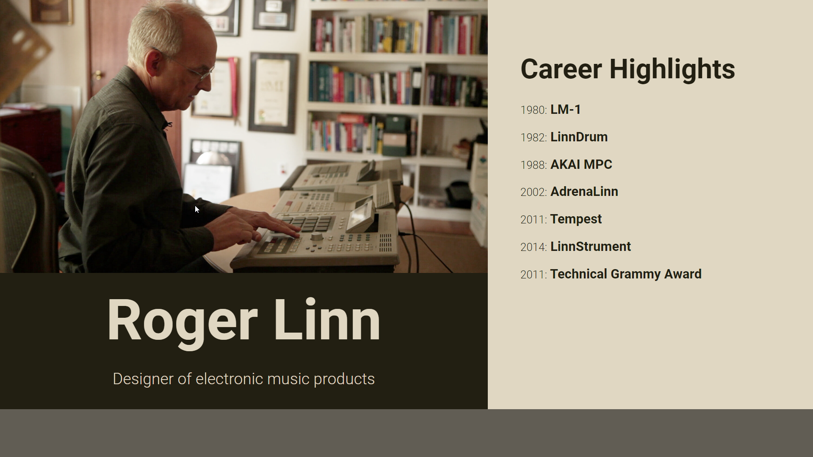
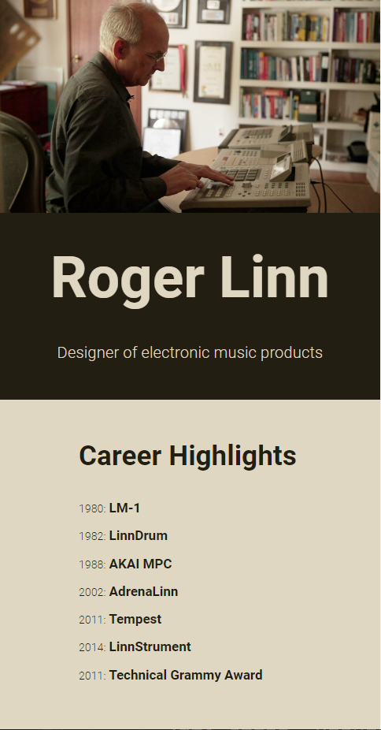

# Roger Linn

This is a simple HTML/CSS project showcasing information about Roger Linn, the renowned designer of electronic music products.

## Live Preview: [Link](https://aras72h.github.io/roger-linn/)





## Introduction

Roger Linn is a pioneering figure in the realm of electronic music. This project provides a brief overview of his career highlights along with a visually appealing layout.

## Technologies Used

- HTML
- CSS

## Features

- Responsive layout suitable for various screen sizes.
- Clear presentation of career highlights.
- Visually appealing design.


### Docker Deployment
```sh
docker built -t roger-linn
docker-compose up -d
```